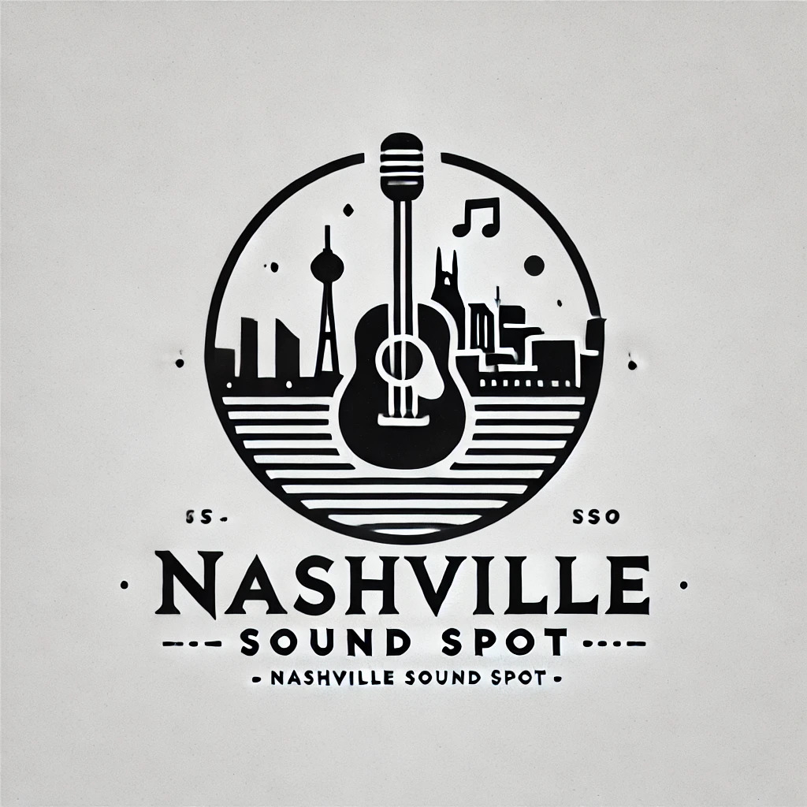

#  Nashville Sound Spot

**Nashville Sound Spot** is my front-end capstone project for Nashville Software School. It's a simple project designed for getting more practice at using the fundamentals of mainly the React library, but also styling with bootstrap.

## Premise of the project

Nashville Sound Spot is designed to be a basic local bands-in-town type of app, where a user can add their band/bands to their profile, and display more information about them, along with what shows they are playing in Nashville area; and other users can save their favorite bands, venues, and discover new bands based on their favorite genres.

## Development

The project was developed using the React library, and styled using a combination of standard bootstrap, along with custom CSS rules. It uses json-server to store and access data, and the react-router-dom package for navigation.

## Install and Run

1. Clone or download this repository.

2. Clone or download my [json-Server api](https://github.com/Clonchmr/Sound-spot-api).

3. In your terminal/command prompt, run `npm install` from the installed directory.

4. In your terminal/command prompt, run `json-server database.json -p 8088` in the `sound-spot-api` directory.

5. In your terminal/command prompt, run `npm run dev` in the `nashville-sound-spot` root directory.
